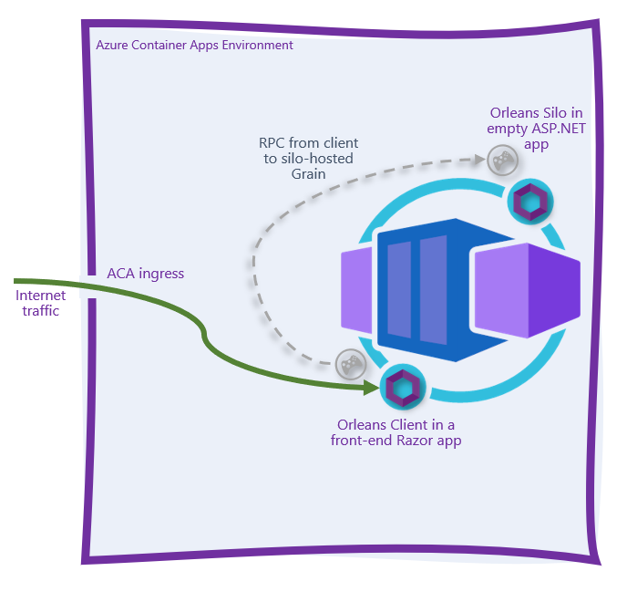

# Orleans Silo + Client on Azure Container Apps

This repository contains a simple solution with an Orleans Silo and an Orleans Client project. Both are deployed to an Azure Container Apps environment, using Azure Storage clustering. The folders off of the root are described below:

* Orleans.Azure.Infrastructure - an experimental project designed to support hosting Orleans Silos in Azure App Service or Container Apps with little wire-up.
* OrleansOnContainerApps.Abstractions - project containing the Grain interfaces.
* OrleansOnContainerApps.Grains - project containing the Grain implementations.
* OrleansOnContainerApps.Silo - a simple ASP.NET Core project that hosts the Orleans silo.
* OrleansOnContainerApps.Client - a simple ASP.NET Core Razor project that serves as a client to the silo and provides a simple user interface.
* ```deploy``` folder - this folder contains a series of [Azure Bicep](http://aka.ms/bicep) templates that can be used to create the application and deploy it.
* ```setup.ps1``` - this file is a one-stop way for you to deploy the app to your own Azure subscription so you can try the scenario. 

## Prerequisites

* .NET 6.0
* The Azure CLI
* An Azure subscription
* Docker
* PowerShell *(GitHub Actions will replace this prerequisite soon)*

## Setup

1. Clone this repository.
2. Sign in to your Azure subscription using the `az login` command.
3. If you have more than 1 Azure subscription, make sure you're targeting the *right* Azure subscription by using the `az account show` and `az account set -s <subscription-id>` commands.
4. From the root of this repository, run `./setup.ps1`. 

## Topology diagram

The resultant application is an Azure Container Environment-hosted set of containers - the `silo`, and the `client` Razor Pages front-end.



Internet traffic should not be able to directly access either of the back-end APIs as each of these containers is marked as "internal ingress only" during the deployment phase. Internet traffic hitting the `client.<your app>.<your region>.azurecontainerapps.io` URL should be proxied to the `client` container, which in turn makes outbound calls to the `silo`  within the Azure Container Apps Environment. 